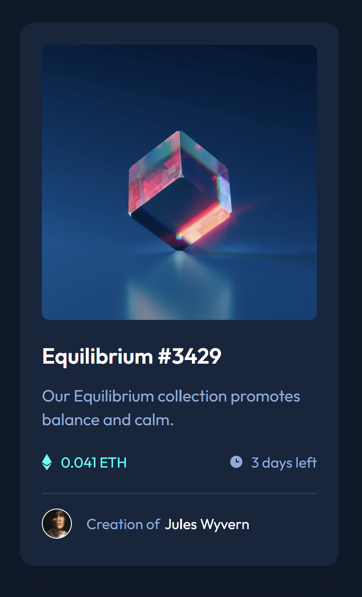
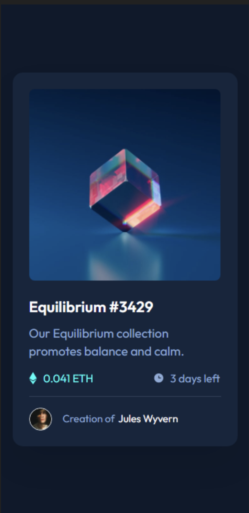

# Frontend Mentor - NFT preview card component solution

This is a solution to the [NFT preview card component challenge on Frontend Mentor](https://www.frontendmentor.io/challenges/nft-preview-card-component-SbdUL_w0U). 

## Table of contents

- [Overview](#overview)
  - [The challenge](#the-challenge)
  - [Screenshot](#screenshot)
  - [Links](#links)
- [My process](#my-process)
  - [Built with](#built-with)
  - [What I learned](#what-i-learned)
  - [Continued development](#continued-development)
  - [Useful resources](#useful-resources)
- [Author](#author)
- [Acknowledgments](#acknowledgments)

## Overview

This seemingly small challenge caught me a bit by surprise. What looked like something quick and simple turned out to be quite detailed, requiring more classes to separate out components that only shared part of their characteristics. For example, different elements would share the same font color, but a different font-size and/or line-height. Moreover, the overlay upon hover needed to be resized for the different screen size. Likewise, this forced the generation of what seemed an inordinate amount of code. 

This developer is open to any suggestions, especially those aimed at reducing the total amount of overall code and improving effeciency.

### The challenge

Users should be able to:

- View the optimal layout depending on their device's screen size
- See hover states for interactive elements
- Create an overlay effect (with icon) upon hover

### Screenshot

Hover states can be tested using the live site below.

### Links

- Solution URL: [Add solution URL here](https://your-solution-url.com)
- Live Site URL: [Add live site URL here](https://your-live-site-url.com)

## My process

### Built with

- Semantic HTML5 markup
- CSS custom properties
- Flexbox
- CSS Grid
- Mobile-first workflow
- [Google Fonts](https://fonts.google.com/) - Google Font Library

### What I learned

As I stated in the introduction, my expectation was that this was a small, quick, project, with less detail that I had at first estimated. Consequently, as I built the CSS for the card, I regularly went back and modified some of my previous code to do some "clean up." This happened to a lesser extent with the HTML, since modifications here were only as a result of changes in the corresponding style sheet.

Where I ended up spending a bit more time was in building proficiency in creating overlays. In the end, I decided to create a flex 
 container with two child 
, one with the original image, and the second with the overlay image. I then set a negative margin on the second 
 to position it over the first image. As a final step, I styled the background-color, opacity, etc. in addition to the hover effect. I am aware that there are other ways to create a hover effect, so if the reader of this text has a suggestion for improvement, or alternatives for various use cases, I would heartily welcome it.

### Continued development

Among the (many) areas of next-steps:
1. Practicing and refining overlay effects (see comment in previous section)
2. Take on a bigger, bit more complex project.
3. Practice more incorporation of JavaScript into for form validation, DOM manipulation, etc.

### Useful resources

As before, my goal is to keep outside resources to a minimum, other than feedback from my peers, and use what I have learned, along with critical thinking, to accomplish the challenge. However, I have to admit that I had to jump on to DevDocs more than once to refresh my memory on a couple of items.

- [DevDocs](https://devdocs.io/)

## Author

Jeff Guleserian

- GitHub - [@jguleserian](https://github.com/jguleserian)
- Frontend Mentor - [@jguleserian](https://www.frontendmentor.io/profile/jguleserian)
- LinkedIn - [@jeffguleserian](https://www.linkedin.com/jeffguleserian)

## Acknowledgments

I want to thank all my fellow-coders at Frontend Mentor who have taken the time to look through my work and provide helpful insight and constructive feedback.
